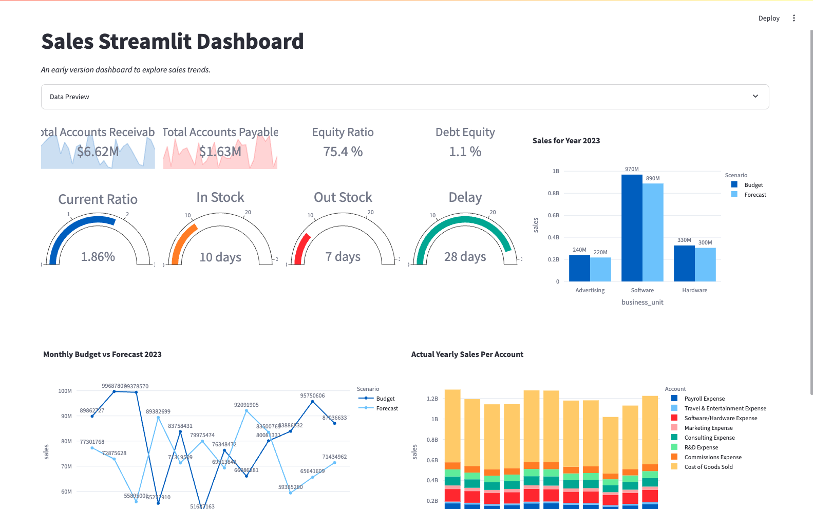

# 📊 Finance Dashboard

This project is an interactive **Finance Dashboard** built using **Streamlit**, **DuckDB**, **Python**, and **Plotly**.

It allows users to upload an Excel file containing financial data, and visualize key financial metrics, monthly trends, and yearly account summaries — all within a clean and simple dashboard.

---

##  Getting Started

### 1. Clone the repository

```bash
git clone https://github.com/Jaybhesania/Finance_Dashboard_Streamlit.git
cd Finance_Dashboard_Streamlit
```

### 2. Set up the environment

Create a new Conda environment with Python 3.10:

```bash
conda create -p my_env python=3.10
conda activate my_env
```

Install required libraries:

```bash
pip install -r requirements.txt
```

### 3. Run the Streamlit app

```bash
streamlit run finance_dashboard.py
```

---

## 📂 Project Structure

```
finance-dashboard/
│
├── finance_dashboard.py   # Streamlit dashboard application
├── README.md               # Project overview and setup instructions
├── requirements.txt        # Libraries & dependencies
└── requirements.txt        # (Optional) Python dependencies

```

---

##  Features

-  Upload Excel financial data directly through the dashboard
-  Preview uploaded data with an expandable view
-  Visualize:
  - Key financial metrics (Accounts Receivable, Payable, Ratios)
  - Sales by Business Unit
  - Monthly Sales Trends
  - Yearly Account Sales
-  Powered by DuckDB SQL for fast in-memory queries
-  Interactive visualizations built using Plotly
-  Simple, clean, and responsive layout with Streamlit

---

##  Built With

- [Streamlit](https://streamlit.io/)
- [DuckDB](https://duckdb.org/)
- [Pandas](https://pandas.pydata.org/)
- [Plotly](https://plotly.com/)
- Python 3.10

---

##  Demo



---

## 🚧 Future Enhancements

- Add year selection dynamically instead of hardcoding 2023
- Support CSV file uploads
- Improved error handling and validation
- Save uploaded data for session history
- Dark mode theme support

---

Built by **Jay Bhesania**
